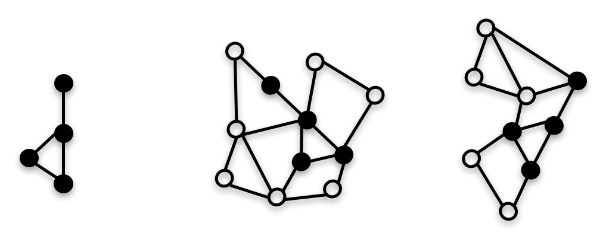

# Residual Gated Graph ConvNets
April 24, 2018
<br>
<br>





### Xavier Bresson
 http://www.ntu.edu.sg/home/xbresson<br>
 https://github.com/xbresson<br>
 https://twitter.com/xbresson <br>
 https://www.facebook.com/xavier.bresson.1 <br>
<br>


### Description
Prototype implementation in PyTorch of the ICLR'18 paper:<br>
An Experimental Study of Neural Networks for Variable Graphs<br>
Xavier Bresson and Thomas Laurent<br>
International Conference on Learning Representations, 2018<br>
ICLR OpenReview: https://openreview.net/pdf?id=SJexcZc8G<br>
ArXiv extended version: [arXiv:1711.07553](https://arxiv.org/pdf/1711.07553.pdf) <br>
<br>

### Codes
The code `01_residual_gated_graph_convnets_subgraph_matching.ipynb` presents an application of the residual gated graph convNets for the problem of sub-graph matching.<br>
The code `02_residual_gated_graph_convnets_semisupervised_clustering.ipynb` shows another application for the problem of semi-supervised_clustering.<br>
<br>


### Installation
   ```sh
   # Conda installation
   curl -o ~/miniconda.sh -O https://repo.continuum.io/miniconda/Miniconda3-latest-Linux-x86_64.sh # Linux
   curl -o ~/miniconda.sh -O https://repo.continuum.io/miniconda/Miniconda3-latest-MacOSX-x86_64.sh # OSX
   chmod +x ~/miniconda.sh
   ./miniconda.sh
   source ~/.bashrc

   # Clone GitHub repo
   git clone https://github.com/xbresson/spatial_graph_convnets.git
   cd spatial_graph_convnets

   # Install python libraries
   conda env create -f environment.yml
   conda activate graph_convnets

   # Run the 2 notebooks
   jupyter notebook
   ```
<br>


### Results
GeForce GTX 1080Ti<br>
* Sub-graph matching: **01_residual_gated_graph_convnets_subgraph_matching.ipynb**, accuracy= 98.85. <br>
* Semi-supervised_clustering: **02_residual_gated_graph_convnets_semisupervised_clustering.ipynb**, accuracy= 75.88. <br>
<br>


### When to use this algorithm?
Any problem that can be cast as analyzing a set of graphs with variable size and connectivity, and one wants to use ConvNets for this analysis.<br>
<br>

<br>
<br>

